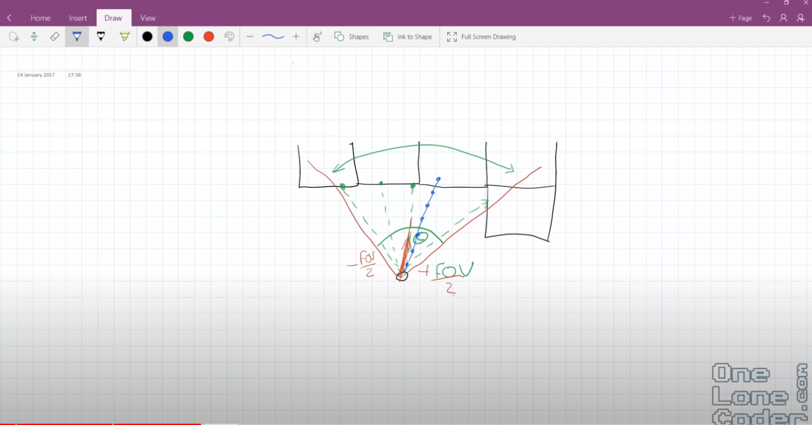

# First Person Shooter

[Youtube Link](https://youtu.be/xW8skO7MFYw)

[Github Link](https://github.com/OneLoneCoder/CommandLineFPS)

## Setup

First, ensure that you have the C/C++ Compiler configured on Windows, such as MinGW and the PATH variable:

```sh
g++ --version
```

Note: You should get something like 'g++ (MinGW.org GCC-6.3.0-1) 6.3.0'.

Next, clone your `cpp` repository from github.com, then create a new sub-directory for this project:

```sh
git clone ...
cd cpp

mkdir first_person_shooter
cd first_person_shooter
```

Save this notes file as `cpp/first_person_shooter/first_person_shooter_nodes.md`.

Push your changes to git:

```sh
cd cpp

git status
git add .
git commit -m "Began C++ First Person Shooter Project"
git push -u origin main
git status
git log --oneline
q
```

## Notes from the Youtube Video

### Console Project

Begin by opening your VSCode instance to the folder `first_person_shooter`. This is your project's root directory.

Next, create a 

```sh
cd first_person_shooter
echo > Source.cpp
```

Write some basic code that allows you to output to the console:

```cpp
// Source.cpp
#include <iostream>
using namespace std;

int main()
{
    for (int i = 0; i < 1000000; i++ )
    cout << "Hello " << i << endl;

    return 0;
}
```

Run this code by click Ctrl-Alt-N, or the following in the command line:

```sh
# have compiler translate the c++ code into machine language code 
g++ -o Source Source.cpp
# run the program
Source
```

Notes:
- The Windows Console is not optimal
    - slow
    - it scrolls
        - ie. when you print all 1,000,000 i's, it takes forever since it has to scroll slowly down the screen

In order to maintain high performance, we cannot use the traditional `std::cout` method.

### Windows Setup

We are going to have to grab the console buffer and write to it directly.
- Not much different than writing to the screen, except we are using characters instead of pixels.

To get ahold of the console in Windows, we will have to do the following:
- call some windows functions
- set some known dimensions

We can do that like this:

```cpp
#include <iostream>
using namespace std;

#include <windows.h>

int nScreenWidth = 120;
int nScreenHeight = 40;

int main()
{
    // Create Screen Buffer
	wchar_t *screen = new wchar_t[nScreenWidth*nScreenHeight];
	HANDLE hConsole = CreateConsoleScreenBuffer(GENERIC_READ | GENERIC_WRITE, 0, NULL, CONSOLE_TEXTMODE_BUFFER, NULL);
	SetConsoleActiveScreenBuffer(hConsole);
	DWORD dwBytesWritten = 0;


    // Display Frame
    screen[nScreenWidth * nScreenHeight - 1] = '\0';
    WriteConsoleOutputCharacter(hConsole, screen, nScreenWidth * nScreenHeight, { 0,0 }, &dwBytesWritten);

    return 0;
}
```

What this does:
- Import Windows Functions
- Set Dimensions
    - 120: Columns
    - 40: Rows
- Create Screen Buffer
    - 2-Dimensional array with width/height vars
    - Get handle to the console (with CreateConsoleScreenBuffer())
    - Tell the buffer that it is going to be our console / target of our console
    - Set the last character
        - Set to escape character (so it knows when to stop outputting the string)
    - Specify the coordinates of where the text is to be written using WriteConsoleOutputCharacter()
        - We want to write to top-left corner
            - Stops console from scrolling down!


Now, with any game engine you need a game loop:

```cpp
#include <iostream>
using namespace std;

#include <windows.h>

int nScreenWidth = 120;// Console Screen Size X (columns)
int nScreenHeight = 40;// Console Screen Size Y (rows)

float fPlayerX = 0.0f;			// Player Start Position
float fPlayerY = 0.0f;
float fPlayerA = 0.0f;			// Player Start Rotation

int nMapWidth = 16;// World Dimensions
int nMapHeight = 16;


int main()
{
    // Create Screen Buffer
	wchar_t *screen = new wchar_t[nScreenWidth*nScreenHeight];
	HANDLE hConsole = CreateConsoleScreenBuffer(GENERIC_READ | GENERIC_WRITE, 0, NULL, CONSOLE_TEXTMODE_BUFFER, NULL);
	SetConsoleActiveScreenBuffer(hConsole);
	DWORD dwBytesWritten = 0;

    // Create map
    wstring map;

    // Start with a big empty room of 16x16
    map += L"################"; // 1
    map += L"#..............#"; // 2
    map += L"#..............#"; // 3
    map += L"#..............#"; // 4
    map += L"#..............#"; // 5
    map += L"#..............#"; // 6
    map += L"#..............#"; // 7
    map += L"#..............#"; // 8
    map += L"#..............#"; // 9
    map += L"#..............#"; // 10
    map += L"#..............#"; // 11
    map += L"#..............#"; // 12
    map += L"#..............#"; // 13
    map += L"#..............#"; // 14
    map += L"#..............#"; // 15
    map += L"################"; // 16
    

    // Game loop
    // - using 1 works, even if you get made fun of it for using it
    while(1)
    {

        // Display Frame
		screen[nScreenWidth * nScreenHeight - 1] = '\0';
		WriteConsoleOutputCharacter(hConsole, screen, nScreenWidth * nScreenHeight, { 0,0 }, &dwBytesWritten);
        
    }

    return 0;
}
```

What else did we do here:
- Store where the player is
    - Cannot use integers (he will clonk around), so use floats
- Angle the player is looking at
- Map ie. the 2D screen
    - Height
    - Width

- Create game loop
    - Moved code that was in main before, over into the while loop

Notes:
- For map, # is a wall, . is an empty space
    - We use data type 'wstring' since it is in Unicode (ie. ut16, Microsoft Windows uses this)
    - Before the string ie. L""
        - 'L' means wchar_t, which, as opposed to a normal character, requires 16-bits of storage rather than 8-bits

Tip: To get from the 16x16 #'s to having the periods on the inside, use Alt
- If you hold alt and click on all 14 lines, you will be able to delete/add periods for all 14 lines at once!

Inspiration for this: 

[Link to Wikipedia](https://en.wikipedia.org/wiki/Wolfenstein_3D)

### Potter Algorithm

Since we are not worried about being able to look up and down, this is just a 2-Dimensional problem.
- We only need to worry about the 1 axis going across the screen
    - Will do computations at each column on the screen

Here is a sketch of what our algorithm will be:



Explanation:
- At any point the player has a field of view
    - Dominantly: Looking straight ahead
- Algo works by taking each column of the console
    - Relates that to a ray, cast within the space of the field of view
        - We have 120 columns on our screen, so 120 rays out into the screen

    - What we are interested in: How far does that ray travel until it hits a surface/a wall?
        - After doing that 120 on the whole field of view, we end with an array of distances!
            - This is why we have a loop going through each column (120) on the screen
            - We have a very narrow field of view

While looping over the 120 columns on the screen, this is what we are doing:
- Calculate the projected starting angle
- Get distance from player to the wall
    - Taking little increments until we find a cell that is a 'wall' cell


### Hit Wall

Let's do the following:
- Implement logic to take little increments until we hit the wall
- 

To make this work, we must change the Properties of the Windows console.
- Right click > Properties
    - Font: Consolas w/ Size 16
    - Layout: _
        - Window size: Width 120, Height 40

    - Note: You can make these the default values with Right click > Defaults

### Rotations

We need to be able to get the character to move. Let's add some controls:
- Use GetAsyncKeyState
    - Using WASD standard layout for first person shooters


### Shading


### Walking Forward


### Floor Shading


### Collision Detection


### Testing Crisis